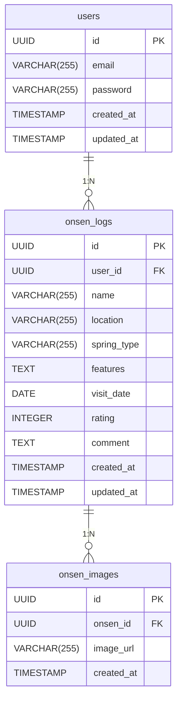

# Yuroku

# 要件定義書（MVP: 温泉メモ機能）**

## **1. プロジェクト概要**

### **1.1 システム名の由来**

**Yuroku（湯録）** は、「湯（温泉）」と「録（記録）」を組み合わせた造語であり、訪れた温泉の体験を詳細に記録することを目的とした名前です。このアプリを通じて、温泉の泉質や特徴、訪問履歴を一元管理し、思い出として残すことができます。

**システム名**：Yuroku

**目的**：
ユーザーが訪れた温泉の情報を簡単に記録し、思い出を残しながら温泉の特性を管理できるアプリを開発する。温泉情報を蓄積し、将来的に活用可能なデータベースとして機能させる。

**ターゲットユーザー**：

- 温泉好きで、訪れた温泉の記録を残したい人
- 温泉の泉質や特徴を記録・比較したい人
- 日帰り温泉や旅行時の温泉巡りの参考にしたい人

**開発範囲**：

- 個人開発の範囲内で実現可能なスコープとし、MVP（Minimum Viable Product）として「温泉メモ機能」のみを実装する。
- 初期段階ではバックエンド（Go + Gin）を中心に開発し、フロントエンドはReact + Next.jsで実装。

---

## **2. MVP（Minimum Viable Product）要件**

### **2.1 必須機能**

### **(1) 温泉データの記録機能**

- **登録可能な項目**：
    - 温泉名（必須）
    - 所在地（都道府県・市区町村、任意）
    - 泉質（硫黄泉・炭酸泉・アルカリ泉など、選択式）
    - 特徴（露天風呂あり・貸切可・源泉掛け流しなど、チェックリスト）
    - 訪問日（カレンダー入力、デフォルトは今日）
    - 評価（5段階評価 or 星評価）
    - コメント（自由記述、最大1000文字）
    - 画像アップロード（1枚〜3枚、任意）

### **(2) 記録データの閲覧・管理機能**

- 記録した温泉を一覧表示
- 温泉詳細ページで登録情報を確認
- 検索 & フィルタ機能（泉質、所在地、評価などで絞り込み）
- 温泉データの削除・編集機能

### **(3) 基本的なユーザー管理（簡易版）**

- ユーザーID（メール or Google認証）
- 自分の記録のみ閲覧・編集・削除可能

### **(4) 温泉データのエクスポート機能**

- JSON形式でバックアップダウンロード
- CSVエクスポート（将来的な分析用）

---

## **3. 技術仕様**

### **3.1 バックエンド**

- 言語：Go
- フレームワーク：Gin
- ORM：mongo-driver
- データベース：MongoDB (Atlas)
- ストレージ：ローカル or S3互換ストレージ（画像保存用）
- API：RESTful API
- その他：Docker, Caddy

### **3.2 フロントエンド**

- Webアプリ（React + Next.js）
- 基本的なUIを実装し、温泉の登録・閲覧・編集・削除が可能にする

---

## **4. 開発ロードマップ**

### **フェーズ1：MVP開発（1〜2ヶ月）**

1. **バックエンド開発**
    - 温泉データのCRUD機能（登録・閲覧・編集・削除）
    - API設計とデータベース設計
    - ユーザー認証（簡易版）
2. **フロントエンド（React + Next.js）**
    - 基本的なデータ入力・閲覧機能の実装

---

## **5. まとめと方針**

- **まずは「温泉メモ機能」** をシンプルに実装し、段階的に機能を拡張。
- **フロントエンドはReact + Next.jsで開発**。
- **バックエンドはGo + Gin + mongo-driver + MongoDB (Atlas) を活用し、Docker/Caddyを組み合わせる**。
- **その他の追加機能（成分コレクション、熟成、RPG要素）は実装対象外とする。**

---


# **Yuroku - システムアーキテクチャ設計書**

## **1. システム概要**

### **1.1 システムの目的**

Yuroku（湯録）は、ユーザーが訪れた温泉を記録し、管理できるシンプルな温泉ログシステムです。バックエンドをGo + Ginで構築し、フロントエンドはNext.jsを利用します。

### **1.2 技術スタック**

| 分類 | 技術 | 備考 |
| --- | --- | --- |
| **バックエンド** | Go + Gin | RESTful APIを提供 |
| **ORM** | mongo-driver | MongoDBとのデータ操作 |
| **データベース** | MongoDB (Atlas) | クラウド管理、スケーラブルなNoSQL |
| **フロントエンド** | React + Next.js | ユーザーインターフェース |
| **認証** | JWT | ユーザー認証に利用 |
| **ストレージ** | S3互換ストレージ or ローカル | 画像アップロード |
| **コンテナ管理** | Docker | 開発 & 本番環境の統一 |
| **リバースプロキシ** | Caddy | 自動HTTPS対応、シンプルな設定 |
| **CI/CD** | GitHub Actions | 自動デプロイ & テスト |

---

## **2. システム構成**

### **2.1 アーキテクチャ図（Mermaid形式）**

```mermaid
graph TD;
    User[ユーザー] -->|リクエスト| NextJS[React + Next.js (フロントエンド)];
    NextJS -->|APIリクエスト| Backend[Go + Gin (APIサーバー)];
    Backend -->|データ操作| DB[MongoDB Atlas (NoSQL)];
    Backend -->|画像保存| Storage[S3 / ローカルストレージ];
    Backend -->|認証管理| Auth[JWT 認証];
    Backend -->|ログ保存| Log[ログ監視ツール];
    Backend -->|リバースプロキシ| Caddy[Caddy (リバースプロキシ)];
    Caddy -->|公開| User;
    GitHubActions[CI/CD (GitHub Actions)] -->|デプロイ| Backend;
    GitHubActions -->|デプロイ| NextJS;

```

---

## **3. コンポーネント詳細**

### **3.1 フロントエンド（Next.js + React）**

- APIと連携し、温泉データを取得・表示
- ユーザー認証を管理（JWT）
- 画像アップロード機能

### **3.2 バックエンド（Go + Gin）**

- RESTful APIを提供
- ユーザー認証（JWT）
- 温泉メモのCRUD処理（登録・取得・更新・削除）
- 画像アップロード処理（S3互換ストレージ）

### **3.3 データベース（MongoDB Atlas）**

- ユーザーデータ（`users` コレクション）
- 温泉メモデータ（`onsen_logs` コレクション）
- 画像データ（`onsen_images` コレクション）
- JSONドキュメント形式で保存
- 必要なフィールドにインデックスを設定

### **3.4 認証（JWT）**

- ユーザー登録 & ログイン
- アクセストークンの発行 & 検証

### **3.5 デプロイ・CI/CD（GitHub Actions）**

- コードの変更を検出し、自動テスト & デプロイ
- Dockerコンテナ化したアプリをクラウド/VPSにデプロイ

### **3.6 ログ管理 & 監視**

- APIリクエストログの保存
- エラーハンドリング & モニタリング

---

## **4. インフラ構成**

### **4.1 開発環境**

| 項目 | 内容 |
| --- | --- |
| OS | macOS / Linux / Windows (WSL) |
| バックエンド | Go + Gin (Docker) |
| フロントエンド | Next.js (Docker) |
| データベース | MongoDB Atlas (無料プラン M0) |
| ストレージ | ローカル or S3互換 |
| CI/CD | GitHub Actions |

### **4.2 本番環境**

| 項目 | 内容 |
| --- | --- |
| OS | Ubuntu / Amazon Linux (VPS or AWS) |
| バックエンド | Go + Gin (Docker) |
| フロントエンド | Next.js (Docker) |
| データベース | MongoDB Atlas |
| ストレージ | S3互換ストレージ |
| リバースプロキシ | Caddy |
| CI/CD | GitHub Actions |

---

## **5. まとめ**

- **Go + Gin + MongoDB Atlas の柔軟なバックエンド**
- **Next.js によるモダンなフロントエンド**
- **NoSQLの特性を活かし、温泉データを自由に管理**
- **JWT 認証でセキュアなアクセス管理**
- **Docker & GitHub Actions による効率的な開発環境**
- **Caddy による自動HTTPS対応 & シンプルなリバースプロキシ管理**

このアーキテクチャで問題なさそうでしょうか？修正点や追加したい要素があれば教えてください！


# **温泉メモ日記アプリ - 機能一覧 & 機能設計書**

## **1. 機能一覧**

### **1.1 ユーザー管理**

| No | 機能名 | 説明 |
| --- | --- | --- |
| 1 | ユーザー登録 | メールアドレスとパスワードでアカウントを作成 |
| 2 | ログイン | JWTを使用して認証し、アクセストークンを発行 |
| 3 | ログアウト | アクセストークンを無効化 |
| 4 | プロフィール編集 | ユーザー名、プロフィール画像を編集 |

### **1.2 温泉メモ管理**

| No | 機能名 | 説明 |
| --- | --- | --- |
| 5 | 温泉メモ登録 | 訪れた温泉の情報を記録（温泉名・泉質・特徴・評価・画像など） |
| 6 | 温泉メモ一覧表示 | 登録した温泉メモの一覧を表示 |
| 7 | 温泉メモ詳細表示 | 1つの温泉メモの詳細情報を表示 |
| 8 | 温泉メモ編集 | 登録済みの温泉メモを編集 |
| 9 | 温泉メモ削除 | 登録した温泉メモを削除 |

### **1.3 画像管理**

| No | 機能名 | 説明 |
| --- | --- | --- |
| 10 | 画像アップロード | 温泉メモに関連する画像をアップロード（最大3枚） |
| 11 | 画像表示 | 温泉メモに関連する画像を表示 |
| 12 | 画像削除 | アップロードした画像を削除 |

### **1.4 その他機能**

| No | 機能名 | 説明 |
| --- | --- | --- |
| 13 | 検索機能 | 温泉名、泉質、評価などでメモを検索 |
| 14 | フィルタ機能 | 訪問日や評価で温泉メモを絞り込み |
| 15 | データエクスポート | JSON形式で温泉メモをエクスポート |

---

## **2. 機能設計書**

### **2.1 ユーザー管理機能**

### **(1) ユーザー登録**

- **入力:**
    - メールアドレス
    - パスワード
- **処理:**
    - メールの形式チェック
    - パスワードのハッシュ化
    - ユーザー情報をMongoDBに保存
- **出力:**
    - JWTトークン（成功時）
    - エラーメッセージ（失敗時）

### **(2) ログイン**

- **入力:**
    - メールアドレス
    - パスワード
- **処理:**
    - メールアドレスとパスワードを照合
    - 一致すればJWTトークンを発行
- **出力:**
    - JWTトークン（成功時）
    - エラーメッセージ（失敗時）

---

### **2.2 温泉メモ管理機能**

### **(3) 温泉メモ登録**

- **入力:**
    - 温泉名
    - 所在地
    - 泉質
    - 特徴
    - 訪問日
    - 評価
    - コメント
- **処理:**
    - データのバリデーション
    - MongoDBに保存
- **出力:**
    - メモID（成功時）
    - エラーメッセージ（失敗時）

### **(4) 温泉メモ一覧表示**

- **入力:**
    - ユーザーID（JWT認証）
- **処理:**
    - ユーザーの温泉メモを取得
    - 並び順（訪問日順、評価順）
- **出力:**
    - 温泉メモのリスト

### **(5) 温泉メモ詳細表示**

- **入力:**
    - メモID
- **処理:**
    - 指定したメモの詳細情報を取得
- **出力:**
    - 温泉メモの詳細データ

### **(6) 温泉メモ編集**

- **入力:**
    - メモID
    - 編集内容
- **処理:**
    - 指定したメモを更新
- **出力:**
    - 更新結果（成功/失敗）

### **(7) 温泉メモ削除**

- **入力:**
    - メモID
- **処理:**
    - 指定したメモを削除
- **出力:**
    - 削除結果（成功/失敗）

---

### **2.3 画像管理機能**

### **(8) 画像アップロード**

- **入力:**
    - メモID
    - 画像ファイル
- **処理:**
    - S3またはローカルストレージに保存
    - MongoDBに画像のURLを記録
- **出力:**
    - 画像URL（成功時）

### **(9) 画像表示**

- **入力:**
    - メモID
- **処理:**
    - 関連する画像のURLを取得
- **出力:**
    - 画像リスト

### **(10) 画像削除**

- **入力:**
    - 画像ID
- **処理:**
    - S3またはローカルストレージから削除
    - MongoDBのレコードを削除
- **出力:**
    - 削除結果（成功/失敗）

---

### **2.4 検索 & フィルタ機能**

### **(11) 検索機能**

- **入力:**
    - キーワード（温泉名・泉質など）
- **処理:**
    - MongoDBで部分一致検索
- **出力:**
    - 該当する温泉メモのリスト

### **(12) フィルタ機能**

- **入力:**
    - 評価・訪問日などの条件
- **処理:**
    - 指定した条件でデータをフィルタリング
- **出力:**
    - 絞り込んだ温泉メモのリスト

---

この機能設計で問題なさそうでしょうか？追加や修正があれば教えてください！


# **温泉メモ日記アプリ - データベース設計書**

## **1. テーブル定義**

### **1.1 users（ユーザー情報）**

| カラム名 | データ型 | 主キー | NULL許可 | デフォルト値 | 備考 |
| --- | --- | --- | --- | --- | --- |
| id | UUID | ○ | NOT NULL | - | ユーザーの一意識別子 |
| email | VARCHAR(255) |  | NOT NULL | - | ユーザーのメールアドレス |
| password | VARCHAR(255) |  | NOT NULL | - | ハッシュ化したパスワード |
| created_at | TIMESTAMP |  | NOT NULL | NOW() | 作成日時 |
| updated_at | TIMESTAMP |  | NOT NULL | NOW() | 更新日時 |

### **1.2 onsen_logs（温泉メモ）**

| カラム名 | データ型 | 主キー | NULL許可 | デフォルト値 | 備考 |
| --- | --- | --- | --- | --- | --- |
| id | UUID | ○ | NOT NULL | - | 温泉メモの一意識別子 |
| user_id | UUID |  | NOT NULL | - | ユーザーID（外部キー） |
| name | VARCHAR(255) |  | NOT NULL | - | 温泉名 |
| location | VARCHAR(255) |  | YES | - | 所在地（都道府県・市区町村） |
| spring_type | VARCHAR(255) |  | YES | - | 泉質（硫黄泉・炭酸泉など） |
| features | TEXT |  | YES | - | 特徴（露天風呂・貸切可など） |
| visit_date | DATE |  | NOT NULL | - | 訪問日 |
| rating | INTEGER |  | YES | 0 | 評価（1〜5） |
| comment | TEXT |  | YES | - | コメント（メモ） |
| created_at | TIMESTAMP |  | NOT NULL | NOW() | 作成日時 |
| updated_at | TIMESTAMP |  | NOT NULL | NOW() | 更新日時 |

### **1.3 onsen_images（温泉画像）**

| カラム名 | データ型 | 主キー | NULL許可 | デフォルト値 | 備考 |
| --- | --- | --- | --- | --- | --- |
| id | UUID | ○ | NOT NULL | - | 画像の一意識別子 |
| onsen_id | UUID |  | NOT NULL | - | 温泉メモID（外部キー） |
| image_url | VARCHAR(255) |  | NOT NULL | - | 画像の保存URL |
| created_at | TIMESTAMP |  | NOT NULL | NOW() | 作成日時 |

---

## **2. ER図**

### **2.1 ERDの概要**

- **users（ユーザー）** が **onsen_logs（温泉メモ）** を複数持つ（一対多）。
- **onsen_logs（温泉メモ）** は **onsen_images（温泉画像）** を複数持つ（一対多）。
- 各温泉メモには訪問日・評価・泉質・コメントなどの情報が含まれる。

**ER図の作成後、表示します。**

---




# **温泉メモ日記アプリ - API仕様書**

## **1. 概要**

本APIは、温泉メモ日記アプリのバックエンドAPIとして機能し、温泉情報の登録、取得、編集、削除を行う。

**ベースURL**: `https://api.example.com/v1`

**認証方式**: JWT（JSON Web Token）

---

## **2. エンドポイント一覧**

### **2.1 ユーザー認証API**

### **[POST] /auth/register** - ユーザー登録

- **リクエストボディ**:
    
    ```json
    {
      "email": "user@example.com",
      "password": "password123"
    }
    
    ```
    
- **レスポンス**:
    
    ```json
    {
      "user_id": "uuid",
      "token": "jwt-token"
    }
    
    ```
    

### **[POST] /auth/login** - ログイン

- **リクエストボディ**:
    
    ```json
    {
      "email": "user@example.com",
      "password": "password123"
    }
    
    ```
    
- **レスポンス**:
    
    ```json
    {
      "user_id": "uuid",
      "token": "jwt-token"
    }
    
    ```
    

---

### **2.2 温泉メモAPI**

### **[POST] /onsen_logs** - 温泉メモの新規作成

- **認証必須**
- **リクエストボディ**:
    
    ```json
    {
      "name": "草津温泉",
      "location": "群馬県",
      "spring_type": "硫黄泉",
      "features": "露天風呂あり, 貸切可",
      "visit_date": "2024-03-01",
      "rating": 5,
      "comment": "最高の温泉でした！"
    }
    
    ```
    
- **レスポンス**:
    
    ```json
    {
      "id": "uuid",
      "message": "温泉メモを作成しました"
    }
    
    ```
    

### **[GET] /onsen_logs** - 温泉メモの一覧取得

- **認証必須**
- **レスポンス**:
    
    ```json
    [
      {
        "id": "uuid",
        "name": "草津温泉",
        "location": "群馬県",
        "spring_type": "硫黄泉",
        "visit_date": "2024-03-01",
        "rating": 5
      }
    ]
    
    ```
    

### **[GET] /onsen_logs/{id}** - 温泉メモの詳細取得

- **認証必須**
- **レスポンス**:
    
    ```json
    {
      "id": "uuid",
      "name": "草津温泉",
      "location": "群馬県",
      "spring_type": "硫黄泉",
      "features": "露天風呂あり, 貸切可",
      "visit_date": "2024-03-01",
      "rating": 5,
      "comment": "最高の温泉でした！"
    }
    
    ```
    

### **[PUT] /onsen_logs/{id}** - 温泉メモの更新

- **認証必須**
- **リクエストボディ**:
    
    ```json
    {
      "rating": 4,
      "comment": "少しぬるかったが、景色は良い"
    }
    
    ```
    
- **レスポンス**:
    
    ```json
    {
      "message": "温泉メモを更新しました"
    }
    
    ```
    

### **[DELETE] /onsen_logs/{id}** - 温泉メモの削除

- **認証必須**
- **レスポンス**:
    
    ```json
    {
      "message": "温泉メモを削除しました"
    }
    
    ```
    

---

### **2.3 温泉画像API**

### **[POST] /onsen_images** - 温泉画像のアップロード

- **認証必須**
- **リクエスト**: `multipart/form-data`
- **レスポンス**:
    
    ```json
    {
      "image_id": "uuid",
      "image_url": "https://storage.example.com/image1.jpg"
    }
    
    ```
    

### **[GET] /onsen_images/{onsen_id}** - 温泉画像の取得

- **認証必須**
- **レスポンス**:
    
    ```json
    [
      {
        "image_id": "uuid",
        "image_url": "https://storage.example.com/image1.jpg"
      }
    ]
    
    ```
    

### **[DELETE] /onsen_images/{image_id}** - 温泉画像の削除

- **認証必須**
- **レスポンス**:
    
    ```json
    {
      "message": "画像を削除しました"
    }
    
    ```
    

---

## **3. エラーレスポンス**

| ステータスコード | メッセージ | 説明 |
| --- | --- | --- |
| 400 | Bad Request | 不正なリクエスト |
| 401 | Unauthorized | 認証エラー |
| 403 | Forbidden | アクセス権限なし |
| 404 | Not Found | リソースが見つからない |
| 500 | Internal Server Error | サーバー内部エラー |

---

## **4. まとめ**

- **JWT認証を用いたユーザー管理**
- **温泉メモのCRUD操作（作成・取得・更新・削除）**
- **温泉画像のアップロード＆管理**
- **RESTfulなAPI設計**

このAPI仕様で開発を進められそうでしょうか？修正や追加の要望があれば教えてください！

この内容で進められそうでしょうか？追加したい要素や変更点があれば教えてください！
